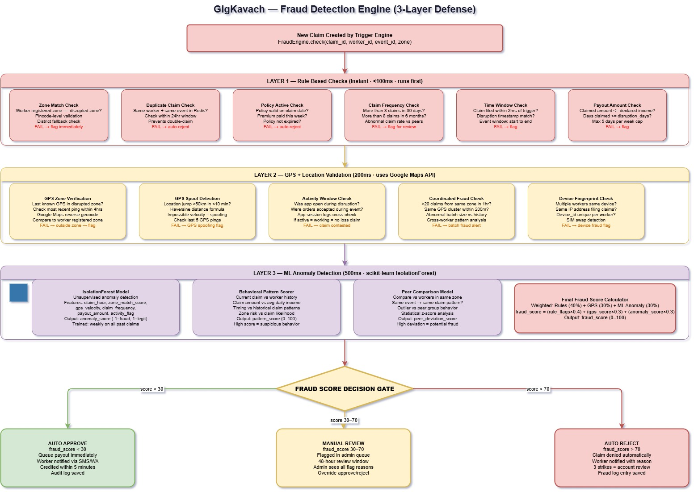
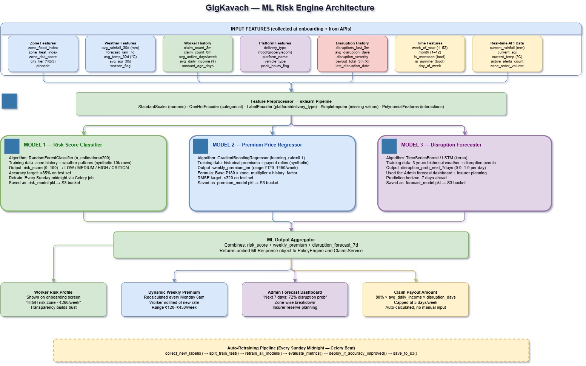
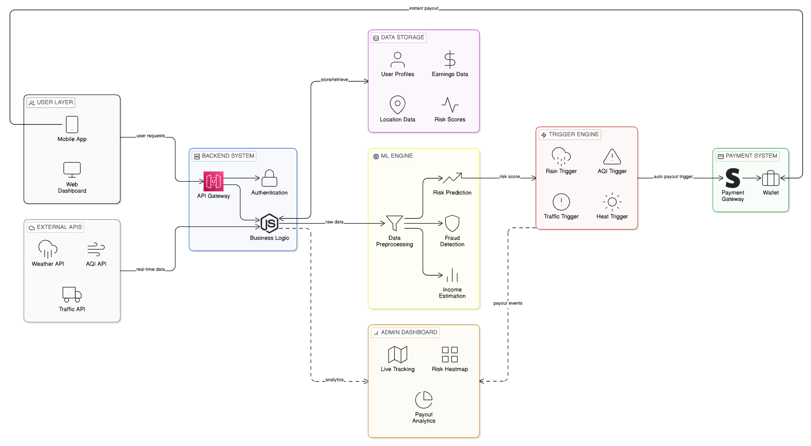

# AI-Powered Income Protection & Smart Savings for Gig Workers | DEVTrails 2026

GigKavach is an AI-powered parametric insurance and smart savings platform designed to protect gig workers from unpredictable income loss caused by external disruptions.

Meet Rahul, a 25-year-old delivery partner working with Zepto in BTM Layout, Bengaluru. He works 10–11 hours a day, completing 15–20 deliveries and earning around ₹900–₹1,100 on a good day. Like millions of gig workers across India, Rahul has no fixed salary, no paid leave, and no job security. His income is entirely dependent on daily work.

However, when unexpected events such as heavy rain, pollution, or local disruptions occur, Rahul is forced to stop working—leading to a sudden drop in earnings with no financial backup.

GigKavach addresses this critical gap by combining AI-driven parametric insurance with a micro-savings model, enabling workers to:

Contribute small amounts seamlessly from their daily earnings

Receive instant payouts during disruptions

Or get their savings returned with interest if no disruption occurs

By ensuring both financial protection and savings growth, GigKavach empowers gig workers with a reliable safety net in an otherwise uncertain work environment.

## How GigKavach Works for Rahul (Example)

1. **Daily Work & Micro-Savings:** As Rahul earns his daily income, a micro-deduction of **₹2 to ₹5 per order** is automatically made.
2. **Coverage Active:** This deduction updates his **Weekly Wallet / Savings Pool**, making his **Coverage Active**.
3. **Disruption Check:** The system continuously monitors for disruptions like **Rain, poor AQI, or Curfews**.

* **Scenario A: Disruption Occurs (YES)**
  * GigKavach calculates a payout of **₹200–₹400 for the day**.
  * Rahul receives an **Instant Payment via UPI**, ensuring his daily financial needs are met. *(Process Ends)*

* **Scenario B: No Disruption Occurs (NO)**
  * Rahul works normally until the **End of the Weekly Plan is Reached**.
  * A **10% Company Fee** is deducted from his pool.
  * An **Interest of 4–5%** is added to his remaining savings.
  * The final amount **(Savings + Interest)** is safely **returned to Rahul** as a weekly payout. *(Process Ends)*


## What We're Building
GigKavach is an AI-powered platform that protects gig workers’ income from disruptions like weather and pollution. It provides a unified dashboard to track earnings, savings, and coverage in real time. The system uses AI to assess risk, suggest optimal work decisions, and recommend safer working zones. It offers automatic insurance with instant payouts during disruptions and a fully automated claim process. Along with protection, it enables micro-savings and cashback with interest if no claims occur. Overall, it combines insurance, savings, and intelligent assistance to improve financial stability and productivity for gig workers.


## MVP_Features

1. Aay Darpan (Earnings Dashboard) – Displays real-time daily and weekly earnings along with protected income.

2. Jokhim Soochak (Risk Indicator) – Provides live risk insights using weather and AQI data.

3. Suraksha Kavach (Smart Insurance) – Automatically activates coverage and gives instant payouts during disruptions.

4. Swayam Claim (Auto Claim System) – Processes claims automatically with real-time status updates.

5. Sahi Chayan (Smart Order Selection) – Recommends the best orders based on earnings, distance, and demand.

6. Surakshit Kshetra Map (Safe Zone Map) – Shows live maps of low, medium, and high-risk working areas.

7. AI Margdarshak (AI Assistant) – Suggests optimal working time and locations for maximum earnings.

8. Vishwas Score (Trust Score) – Detects fraud and assigns a reliability score to users.

9. Kaarya Pradarshan (Performance Tracker) – Monitors work efficiency and delivery performance.

10. SurakshaPay (Savings Wallet) – Enables micro-savings with easy deposit and withdrawal options.

11. Bonus Vaapsi (Cashback Rewards) – Returns savings with interest if no claims are made.

12. Bhasha Sathi (Language Assistant) – Provides multilingual voice support for better accessibility.

13. Smart Suchna (Smart Notifications) – Sends real-time alerts for risks, disruptions, and earning opportunities.


## Core Disruptions Covered
GigKavach protects gig workers from income loss caused by:

1. Environmental Disruptions

    1.1 Heavy Rainfall

    1.2 Flooding / Waterlogging

    1.3 Extreme Heat

    1.4 High Pollution (AQI levels)

2. Human-Created Disruptions

    2.1 Traffic Congestion

    2.2 Curfews / Local Restrictions

    2.3 Strikes / Roadblocks

    2.4 Sudden Zone Closures
    

    
## AI/ML Integration

### 1. Risk Scoring Engine (Zone-level disruption prediction)
* **Model**: Gradient Boosting (`scikit-learn`)
* **Features in**: Rainfall frequency (historical 3–5 yr), flood event count, heatwave days/yr, average winter AQI, storm frequency, zone elevation, drainage quality flag.
* **Output**: Zone risk score (`0–100`) → directly drives weekly premium calculation. The ML model's predicted score is the sole input into the premium tier lookup; there is no separate manual pricing step. Premium calculation is therefore entirely AI-driven.
* **Why Gradient Boosting?** Handles non-linear interactions between risk factors (e.g. flood risk is not linear in rainfall, it spikes when drainage capacity is exceeded). Outperforms linear regression on small, structured environmental datasets. Retrained weekly on new disruption event data, so premiums stay calibrated as climate patterns shift.

### 2. Fraud Detection Engine (Anomaly detection on GPS + claim patterns)
* **Model**: Isolation Forest + rule-based validation layer
* **Features in**: GPS speed between consecutive points, location jump distance/minute, idle time ratio, zone boundary crossing frequency, historical claim rate per rider.
* **Output**: Fraud risk score (Low / Medium / High / Critical) → payout held if Critical.
* **Why Isolation Forest?** Unsupervised, no labelled fraud data needed at launch. Naturally identifies outliers (e.g. a rider whose GPS shows 120 km/h in BTM Layout) without requiring prior fraud examples.

### 3. Income Baseline Estimator (Per-zone, per-hour expected earnings)
* **Model**: Gradient Boosting regression
* **Features in**: POI density (restaurants, dark stores), population density, road connectivity index, historical order volume, time of day, day of week.
* **Output**: `Expected_Income(zone, time)` → baseline for payout calculation.
* **Why not use platform data?** Platform earnings APIs are unavailable. Proxy variables (POI density × connectivity / traffic factor) have a strong correlation with actual delivery volume in Q-commerce zones.

### 4. Disruption Forecasting (Optional, Phase 3)
* **Model**: Facebook Prophet (time-series)
* **Features in**: Historical weather data, seasonal patterns, IMD forecasts.
* **Output**: Probability of disruption event in next 48 hrs → used for proactive rider notifications and dynamic risk adjustment.

## Fraud Detection Architecture


To ensure the integrity of the platform, a multi-layer validation process runs before every payout:

### Layer 1: GPS Anomaly Detection
* **Speed check**: `> 80 km/h` between consecutive GPS points → **Flag**
* **Location jump**: `> 5 km` displacement in 1 minute → **Flag**
* **Mock location detection**: Device-level check for GPS spoofing apps or active developer mode.
* **Path continuity**: Non-road trajectories are flagged.

### Layer 2: Activity Verification
* **Minimum distance**: `> 1 km` covered within any 30-minute window.
* **Idle threshold**: `< 15 minutes` continuous idle during an active working session.
* **Speed range**: `10–40 km/h` (consistent with urban two-wheeler delivery profiles).
* **Zone presence**: Rider must be physically in the disruption zone for `≥ 50%` of the event duration.

### Layer 3: Duplicate Claim Prevention
* Each disruption event is assigned a unique `Event_ID`.
* **Uniqueness check**: A combination of `(Rider_ID + Event_ID + Zone_ID)` must be unique. If a record already exists, it is rejected.
* One payout per rider per disruption event is strictly enforced at the database level.

### Layer 4: Policy Validation
* An active weekly policy is required precisely at the time of the disruption.
* A `12–24 hr` waiting period is enforced after a policy purchase to prevent workers from buying a policy *after* an event has already started.

### ML Risk Engine


### Risk Scoring Actions

| Risk Level | System Response |
| :--- | :--- |
| **Low** | Session monitored, payout proceeds automatically. |
| **Medium** | Session flagged, payout proceeds but with a detailed audit log. |
| **High** | Payout held for 24 hrs, manual review queued. |
| **Critical** | Payout completely blocked, account explicitly flagged. |

## Architecture Diagram




## Development Plan

### Phase 1: Core Backend & Data Ingestion (Completed)
- [x] Node.js Business Logic and Authentication setup
- [x] API Gateway configuration for secure request routing
- [x] Data Storage schema design (User Profiles, Location Data, Earnings Data, Risk Scores)
- [x] Integration with 🌐 External APIs (Weather API, AQI API, Traffic API)
- [x] Setting up basic Admin Dashboard for Live Tracking
- [x] Core architecture planning & finalization

###  Phase 2: ML Engine & Automated Triggers (Current)
- [ ] ML Engine setup (Data Preprocessing pipelines, Income Estimation)
- [ ] Implement Risk Prediction modeling using real-time API data
- [ ] Deploy statistical Fraud Detection models
- [ ] Trigger Engine implementation (Rain, AQI, Traffic, and Heat triggers)
- [ ] Automated risk score evaluation pipeline (ML Engine → Trigger Engine)
- [ ] Risk Heatmap integration on the Admin Dashboard

###  Phase 3: Client Apps & Payment Execution (Upcoming)
- [ ] User Layer Development (Mobile App for gig workers, Web Dashboard)
- [ ] Linking continuous user requests directly into the Backend System
- [ ] Payment System implementation (Stripe Payment Gateway, Digital Wallet mechanism)
- [ ] End-to-end auto-payout trigger testing (Trigger Engine → Payment System)
- [ ] Payout Analytics module deployment on the Admin Dashboard
- [ ] Final end-to-end simulation (Simulated environmental triggers → Instant Payouts via Wallet)

# System Architecture

## Component Overview

```
External Data Sources
  Weather API · AQI Data · GPS/Maps · Traffic Data · Flood Alerts
                          ↓
              Backend System (Kavach Core Engine)
    ┌─────────────────────────────────────────────┐
    │  Vighna Engine (Disruption Detection)       │
    │  Jokhim Engine (Risk Scoring)               │
    │  Vishwas Engine (Fraud Detection)           │
    │  Payout Engine (Compensation Logic)         │
    │  Activity Engine (Work Verification)        │
    │  ML Engine (Prediction Pipeline)            │
    └─────────────────────────────────────────────┘
                          ↓
         Data Layer (Supabase + PostGIS)
    Users · Zones · Policies · Claims · GPS Logs · Audit Logs
                          ↓
         ┌────────────────────────────────┐
         │  Rider App (Mobile)            │
         │  Admin Dashboard (Web)         │
         │  Notification System (FCM)     │
         │  Payment System (Razorpay)     │
         └────────────────────────────────┘
```

---

## External Data Sources

* Weather API: Rainfall, storms, temperature
* AQI Data: Pollution monitoring
* GPS and Maps: Location tracking
* Traffic APIs: Congestion analysis
* Disaster Alerts: Real-time disruption signals

---

## Backend System (Kavach Core Engine)

### Vighna Engine (Disruption Detection)

Detects real-time disruptions at zone level.

### Jokhim Engine (Risk Scoring)

Calculates risk based on environmental and historical data.

### Vishwas Engine (Fraud Detection)

Identifies anomalies using behavioral and sensor data.

### Payout Engine (Compensation Logic)

Calculates payouts using hybrid model.

### Activity Engine (Work Verification)

Validates rider activity during disruption.

### ML Engine (Prediction Pipeline)

Handles risk prediction and forecasting.

---

## Database Layer

Supabase with PostgreSQL and PostGIS

* User data
* Zone mapping
* Policy management
* Claims tracking
* GPS logs
* Audit trails

---

## Client Applications

### Rider Application

* Session tracking
* Earnings dashboard
* Risk alerts
* Claim tracking

### Admin Dashboard

* Live monitoring
* Analytics
* Fraud review

### Notification System

* Real-time alerts
* Claim updates

### Payment System

* Policy purchase
* Instant payouts

---

## Why Mobile First

* Works on low-end devices
* Handles poor connectivity
* Supports background tracking
* Optimized for field usage

---

## Hyperlocal Zone Model

* 2 km × 2 km grid system
* Accurate disruption detection
* Better fraud control

---

## Application Workflow

```
User Signup
   ↓
Zone Assignment
   ↓
Policy Activation
   ↓
Work Session Start
   ↓
Disruption Monitoring
   ↓
Disruption Detected?
   YES → Verify → Calculate → Fraud Check → Payout
   NO  → Continue Work
   ↓
Session End → Summary
```

---

## Technology Stack

| Layer               | Technology                        | Purpose                       |
| ------------------- | --------------------------------- | ----------------------------- |
| Client Applications | Flutter (Mobile) + React (Web)    | Rider app and admin dashboard |
| Backend             | FastAPI / Node.js                 | API and business logic        |
| Database            | Supabase (PostgreSQL)             | Data management and auth      |
| Geospatial          | PostGIS                           | Location and zone processing  |
| AI/ML               | Python (scikit-learn, Prophet)    | Prediction and risk models    |
| External APIs       | OpenWeatherMap, AQI, Traffic APIs | Real-time data ingestion      |
| Payments            | Razorpay                          | Premiums and payouts          |
| Notifications       | Firebase Cloud Messaging          | Real-time alerts              |

---

## Screenshots (System Architecture)

### Architecture Overview

* Overall system flow (External APIs → Backend → Database → Client Apps)
* Kavach Core Engine modules (Vighna, Jokhim, Vishwas, Payout, Activity, ML)

### Backend System

* Engine-wise breakdown (Disruption, Risk, Fraud, Payout, ML)
* API layer and processing pipeline

### Client Applications

* Rider Mobile App interface
* Admin Web Dashboard interface

### Data Layer

* Database schema (Users, Zones, Policies, Claims)
* Geospatial mapping (PostGIS zones)

Store all screenshots inside an `/images` folder and reference them here using:

```


```

---

## Key Design Decisions

Parametric Model

* Instant payouts
* No manual claims

Hybrid Risk Model

* Multiple signals for accuracy

Zone-Based System

* Localized decision making
* Scalable architecture

---

## Team Tagline

bug_hunter – Building intelligent systems that protect, predict, and empower gig workers in real time.
